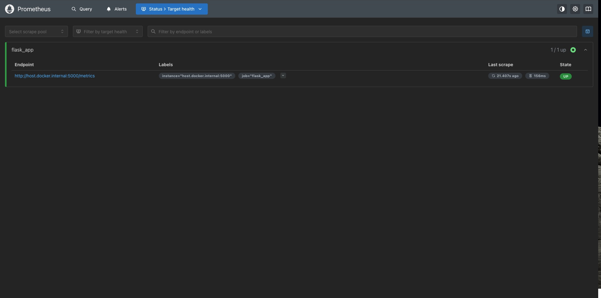
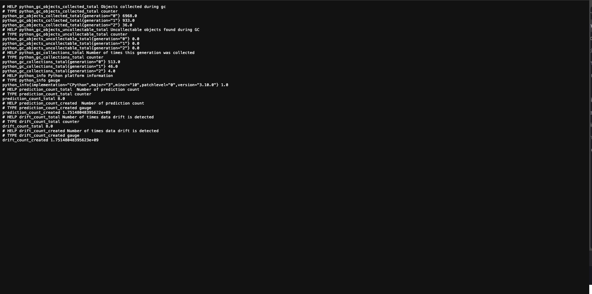

# Titanic Survival Prediction - MLOps Pipeline


A complete MLOps pipeline for predicting Titanic passenger survival using Apache Airflow, Redis Feature Store, Flask web application, and machine learning best practices.

## 🏗️ Architecture Overview

```
GCP Cloud Storage → Apache Airflow → PostgreSQL → Feature Engineering → Redis Feature Store → ML Model Training → Model Artifacts → Flask Web App → Prometheus → Grafana Dashboard
```

## 📁 Project Structure

```
Titanic_Survival/
├── src/                          # Core application modules
│   ├── data_ingestion.py         # Data extraction from PostgreSQL
│   ├── data_processing.py        # Feature engineering & SMOTE resampling
│   ├── feature_store.py          # Redis-based feature store
│   ├── model_training.py         # ML model training with hyperparameter tuning
│   ├── custom_exception.py       # Custom exception handling
│   └── logger.py                 # Centralized logging
├── dags/                         # Airflow DAGs
│   ├── extract_data_from_gcp.py  # GCS to PostgreSQL data pipeline
│   └── exampledag.py            # Example Airflow DAG
├── pipeline/                     # End-to-end training pipeline
│   └── training_pipeline.py      # Complete ML pipeline orchestration
├── config/                       # Configuration files
│   ├── database_config.py        # Database connection settings
│   └── paths_config.py          # File paths configuration
├── templates/                    # Flask web application templates
│   └── index.html               # Interactive prediction interface
├── artifacts/                    # Model artifacts and data
│   ├── models/                   # Trained models (RandomForest: 94.9% accuracy)
│   └── raw/                      # Raw datasets
├── logs/                         # Application logs
├── tests/                        # Test files
│   └── dags/                     # DAG tests
├── notebook/                     # Jupyter notebooks for exploration
├── application.py                # Flask web application
├── docker-compose.yaml           # Docker Compose for monitoring stack
├── prometheus.yml                # Prometheus configuration
├── Dockerfile                    # Container configuration
├── requirements.txt              # Python dependencies
├── setup.py                      # Package setup
├── titanic-web-ui.png           # Web application interface screenshot
├── Grafana Visual Board.jpg      # Grafana dashboard screenshot
├── Promethues.jpg               # Prometheus interface screenshot
├── metrics.jpg                  # Metrics endpoint screenshot
└── Terminal Outputs.jpg         # Terminal execution logs screenshot
```

## 🚀 Features

### Data Pipeline
- **Data Ingestion**: Automated extraction from GCP Cloud Storage to PostgreSQL
- **Feature Engineering**: Advanced feature creation including family size, titles, and interaction features
- **Class Imbalance Handling**: SMOTE (Synthetic Minority Oversampling Technique) implementation
- **Feature Store**: Redis-based feature storage for real-time serving

### ML Pipeline
- **Model**: Random Forest Classifier with hyperparameter tuning
- **Performance**: 94.9% accuracy on test set
- **Features**: 11 engineered features including Pclass, Age, Fare, Sex, Embarked, etc.
- **Validation**: Cross-validation with RandomizedSearchCV

### Web Application
- **Interactive Interface**: Flask-based web application for real-time predictions
- **User-Friendly UI**: Modern, responsive design with gradient backgrounds
- **Real-Time Predictions**: Instant survival probability calculations
- **Input Validation**: Comprehensive form validation and error handling
- **Data Drift Detection**: KS-Drift monitoring for model performance tracking
- **Metrics Collection**: Prometheus metrics for prediction and drift monitoring

### MLOps Components
- **Orchestration**: Apache Airflow for workflow management
- **Monitoring**: Comprehensive logging system with Prometheus integration
- **Data Drift Detection**: Alibi-detect KS-Drift implementation with automatic port management
- **Metrics Endpoint**: Real-time metrics available at `/metrics` endpoint
- **Containerization**: Docker support with Astronomer runtime
- **Feature Store**: Redis for feature serving and storage
- **Web Deployment**: Flask application ready for production deployment
- **Visualization**: Grafana dashboards for real-time monitoring and analytics
- **Metrics Collection**: Prometheus for scraping and storing application metrics

## 🛠️ Installation & Setup

### Prerequisites
- Python 3.10+
- Docker & Docker Compose
- Redis Server
- PostgreSQL
- GCP Account with Cloud Storage
- Flask (for web application)
- Prometheus (for metrics collection)
- Grafana (for visualization)

### Environment Setup
```bash
# Clone repository
git clone <repository-url>
cd Titanic_Survival

# Create virtual environment
python -m venv venv
source venv/bin/activate  # On Windows: venv\Scripts\activate

# Install dependencies
pip install -r requirements.txt

# Start Redis server
redis-server

# Start monitoring stack (Prometheus & Grafana)
docker-compose up -d

# Start Airflow (using Astronomer)
astro dev start
```

### Configuration
1. **Database Configuration**: Update `config/database_config.py` with your PostgreSQL credentials
2. **GCP Setup**: Place your GCP service account key in `include/gcp-key.json`
3. **Airflow Connections**: Configure GCS and PostgreSQL connections in Airflow UI

## 🔄 Pipeline Execution

### Option 1: Complete Pipeline
```bash
python pipeline/training_pipeline.py
```

### Option 2: Individual Components
```bash
# Data ingestion
python src/data_ingestion.py

# Data processing & feature engineering
python src/data_processing.py

# Model training
python src/model_training.py
```

### Option 3: Airflow DAG
1. Access Airflow UI at `http://localhost:8080`
2. Trigger `extract_titanic_data` DAG
3. Monitor pipeline execution

### Option 4: Web Application
```bash
# Run Flask web application
python application.py

# Access web interface at http://localhost:5001
# Prometheus metrics available at http://localhost:8000+ (auto-assigned port)
```

### Option 5: Monitoring Stack
```bash
# Start Prometheus and Grafana
docker-compose up -d

# Access Prometheus at http://localhost:9090
# Access Grafana at http://localhost:3000 (admin/admin)
```

## 📊 Model Performance

- **Algorithm**: Random Forest Classifier
- **Accuracy**: 94.9%
- **Best Parameters**: 
  - n_estimators: 300
  - max_depth: 30
  - min_samples_split: 2
  - min_samples_leaf: 1

### Feature Engineering
- **Age**: Median imputation for missing values
- **Embarked**: Mode imputation
- **Sex**: Binary encoding (male: 0, female: 1)
- **Title**: Extracted from names (Mr, Miss, Mrs, Master, Rare)
- **Family Size**: SibSp + Parch + 1
- **Is Alone**: Binary indicator for solo travelers
- **Has Cabin**: Binary indicator for cabin information
- **Interaction Features**: Pclass_Fare, Age_Fare

## 🗄️ Feature Store

Redis-based feature store with:
- **Original Features**: Stored with PassengerId as key
- **SMOTE Features**: Synthetic samples with `smote_` prefix
- **Real-time Retrieval**: Fast feature serving for inference
- **Batch Operations**: Efficient bulk feature storage

### Usage Example
```python
from src.feature_store import RedisFeatureStore

feature_store = RedisFeatureStore()
features = feature_store.get_feature(entity_id=332)
print(features)
# Output: {'Pclass': 1, 'Age': 45.5, 'Fare': 28.5, ...}
```

## 📈 Monitoring & Logging

- **Centralized Logging**: All components log to `logs/log_YYYY-MM-DD.log`
- **Error Tracking**: Custom exception handling with detailed error messages
- **Pipeline Monitoring**: Airflow UI for DAG monitoring and debugging
- **Data Drift Monitoring**: KS-Drift detection with automatic logging
- **Prometheus Metrics**: Real-time metrics collection for:
  - `prediction_count`: Number of predictions made
  - `drift_count`: Number of drift events detected
  - `scrape_duration`: Time taken for metrics scraping
  - `sample_post_metrics`: Sample POST request metrics

### Grafana Dashboard


The Grafana dashboard provides comprehensive monitoring with:
- **Drift Count**: Real-time data drift detection metrics
- **Scrape Duration**: Prometheus scraping performance metrics
- **Prediction Count**: Total number of predictions made
- **Sample POST Metrics**: API request performance tracking

### Prometheus Metrics



Prometheus collects and stores metrics from the Flask application:
- **Target Health**: Monitoring application availability
- **Metrics Scraping**: 15-second interval data collection
- **Query Interface**: Advanced PromQL query capabilities



### Recent Pipeline Execution (from logs):
```
2025-07-02 19:46:17,552 - INFO - Accuracy is 0.949438202247191
2025-07-02 19:46:17,579 - INFO - Model saved at artifacts/models/random_forest_model.pkl
2025-07-02 19:46:17,580 - INFO - End of Model Training pipeline...
2025-07-02 22:08:18,012 - WARNING - KSDrift not available - drift detection disabled
2025-07-02 22:12:57,013 - INFO - Drift Detected....
```

### Terminal Outputs


## 🌐 Web Application


The Flask web application provides an interactive interface for making survival predictions:

### Features
- **Interactive Form**: User-friendly input form with 11 feature fields
- **Real-Time Predictions**: Instant survival probability calculations
- **Modern UI**: Responsive design with gradient backgrounds and animations
- **Error Handling**: Comprehensive validation and error messages
- **Data Drift Detection**: Real-time drift monitoring using KS-Drift algorithm
- **Prometheus Metrics**: Automated metrics collection for predictions and drift events
- **Auto Port Management**: Automatic port assignment to avoid conflicts

### Usage
1. Start the application: `python application.py`
2. Navigate to `http://localhost:5001`
3. Fill in passenger details:
   - Age, Fare, Passenger Class
   - Gender, Port of Embarkation
   - Family Size, Cabin Status
   - Title, Interaction Features
4. Click "Predict My Fate!" for instant results

### Input Features
- **Age**: Passenger age (numeric)
- **Fare**: Ticket fare paid (numeric)
- **Pclass**: Passenger class (1, 2, or 3)
- **Sex**: Gender (Male: 0, Female: 1)
- **Embarked**: Port (Cherbourg: 0, Queenstown: 1, Southampton: 2)
- **Familysize**: Total family members aboard
- **Isalone**: Solo traveler indicator (Yes: 1, No: 0)
- **HasCabin**: Cabin assignment indicator (Yes: 1, No: 0)
- **Title**: Passenger title (Mr: 1, Miss: 2, etc.)
- **Pclass_Fare**: Interaction feature (Pclass × Fare)
- **Age_Fare**: Interaction feature (Age × Fare)

## 🔧 Configuration Files

### Database Configuration
```python
# config/database_config.py
DB_CONFIG = {
    'host': 'localhost',
    'port': 5432,
    'database': 'titanic_db',
    'user': 'your_username',
    'password': 'your_password'
}
```

### Paths Configuration
```python
# config/paths_config.py
RAW_DIR = "artifacts/raw/"
TRAIN_PATH = "artifacts/raw/titanic_train.csv"
TEST_PATH = "artifacts/raw/titanic_test.csv"
```

### Flask Application Configuration
```python
# application.py
MODEL_PATH = "artifacts/models/random_forest_model.pkl"
FEATURE_NAMES = [
    'Pclass', 'Age', 'Fare', 'Sex', 'Embarked', 'Familysize', 'Isalone',
    'HasCabin', 'Title', 'Pclass_Fare', 'Age_Fare'
]

# Prometheus Metrics
prediction_count = Counter('prediction_count', 'Number of predictions')
drift_count = Counter('drift_count', 'Number of drift events detected')

# Data Drift Detection
ksd = KSDrift(x_ref=historical_data, p_val=0.05)  # If available
```

## 🚀 Deployment

### Local Development
```bash
# Start monitoring stack
docker-compose up -d

# Start Airflow
astro dev start

# Start Flask application
python application.py
```

### Production (Astronomer)
```bash
astro deploy
```

### Docker Deployment
```bash
# Start monitoring stack
docker-compose up -d

# Build container
docker build -t titanic-survival .

# Run container
docker run -p 5001:5001 titanic-survival
```

### Monitoring Stack Configuration

#### Prometheus Configuration (prometheus.yml)
```yaml
global:
  scrape_interval: 15s

scrape_configs:
  - job_name: 'flask_app'
    static_configs:
      - targets: ['host.docker.internal:5000']
```

#### Docker Compose Services
```yaml
services:
  prometheus:
    image: prom/prometheus:latest
    ports:
      - "9090:9090"
    volumes:
      - ./prometheus.yml:/etc/prometheus/prometheus.yml

  grafana:
    image: grafana/grafana:latest
    ports:
      - "3000:3000"
    environment:
      GF_SECURITY_ADMIN_PASSWORD: "admin"
```

### Container Configuration
- **Base Image**: Astronomer Runtime 12.6.0
- **Additional Providers**: Google Cloud providers for Airflow
- **Port**: 5001 (Flask application)
- **Dependencies**: All requirements from requirements.txt

## 🤝 Contributing

1. Fork the repository
2. Create feature branch (`git checkout -b feature/AmazingFeature`)
3. Commit changes (`git commit -m 'Add AmazingFeature'`)
4. Push to branch (`git push origin feature/AmazingFeature`)
5. Open Pull Request

## 📝 License

This project is licensed under the MIT License - see the LICENSE file for details.

## 🔗 Technologies Used

- **ML/Data**: pandas, scikit-learn, imbalanced-learn, numpy
- **Web Framework**: Flask
- **Orchestration**: Apache Airflow, Astronomer
- **Storage**: Redis, PostgreSQL, GCP Cloud Storage
- **Containerization**: Docker, Docker Compose
- **Monitoring**: Custom logging system, Prometheus, Grafana, Alibi-detect (KS-Drift)
- **Metrics**: prometheus_client for real-time monitoring
- **Visualization**: Grafana dashboards with custom panels
- **Frontend**: HTML5, CSS3, JavaScript (responsive design)
- **Database**: PostgreSQL with psycopg2-binary connector

---

**Note**: This project demonstrates a production-ready MLOps pipeline with proper separation of concerns, error handling, and monitoring capabilities.
